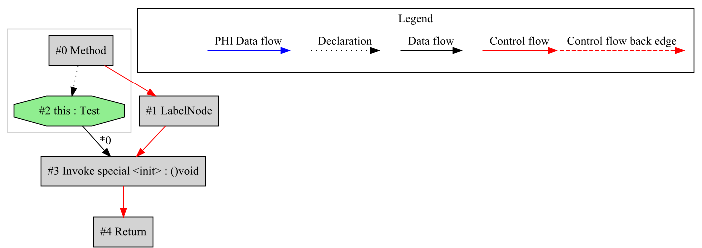
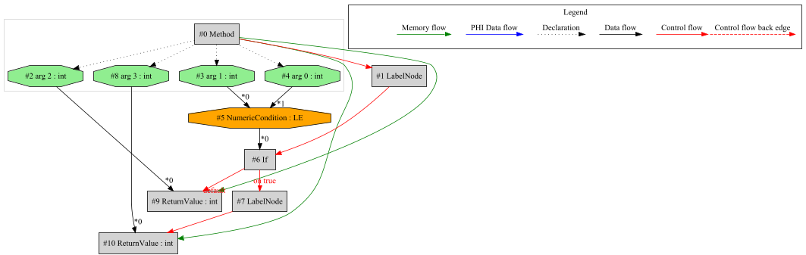
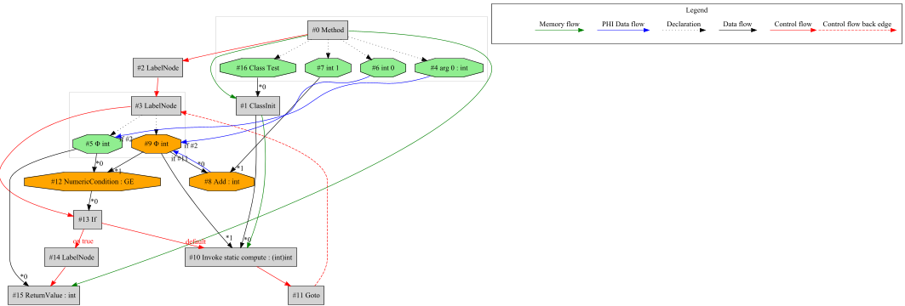
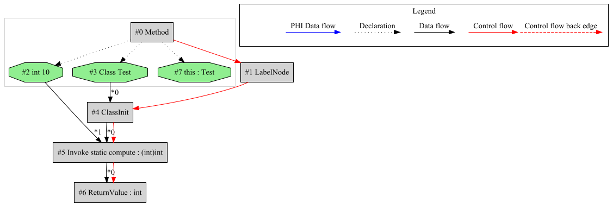

# MetaIR

MetaIR is a graph-based intermediate representation (IR) for JVM bytecode, built on Cliff Click's Sea-of-Nodes concept. T
he framework leverages the Java Class-File API introduced in Java 24 (JEP 484).

## Key Features

- **Analysis**: Transform and inspect existing JVM bytecode
- **Visualization**: Debug functionality for graph representation
- **Optimization**: Built-in peephole optimizations for graph reduction
- **Cross-Compilation**: Foundation framework for cross-compiler development

## Technical Details
- Built on [Java Class-File API (JEP 484)](https://openjdk.org/jeps/484)
- Implements Sea-of-Nodes IR design
- Further examples and documentation: [SeaOfNodes/Simple](https://github.com/SeaOfNodes/Simple)

> 🚧 Scheduling logic for machine code transformation is under development.

## Example constructor invocation

A simple Java example with constructor invocation:
```
public class Test {

    public Test() {
    }
}

```

Class-File API Debug YAML:
```
  - method name: <init>
    flags: [PUBLIC]
    method type: ()V
    attributes: [Code]
    code: 
        max stack: 1
        max locals: 1
        attributes: [LineNumberTable, LocalVariableTable]
        line numbers: 
          - {start: 0, line number: 5}
          - {start: 4, line number: 6}
        local variables: 
          - {start: 0, end: 5, slot: 0, name: this, type: Lde/mirkosertic/metair/Test;}
        //stack map frame @0: {locals: [THIS], stack: []}
        0: {opcode: ALOAD_0, slot: 0, type: Lde/mirkosertic/metair/Test;, variable name: this}
        1: {opcode: INVOKESPECIAL, owner: java/lang/Object, method name: <init>, method type: ()V}
        4: {opcode: RETURN}
```

Generated IR (raw and unoptimized):



## Example if / conditional logic

A simple Java example with an if-statement returning different values based on a condition:
```
public class Test {

    public static int simpleIf(int a, int b, int c, int d) {
        if (a > b) {
            return c;
        } else {
            return d;
        }
    }
}
```

Class-File API Debug YAML:
```

  - method name: simpleIf
    flags: [PUBLIC, STATIC]
    method type: (IIII)I
    attributes: [Code]
    code: 
        max stack: 2
        max locals: 4
        attributes: [LineNumberTable, LocalVariableTable, StackMapTable]
        line numbers: 
          - {start: 0, line number: 9}
          - {start: 5, line number: 10}
          - {start: 7, line number: 12}
        local variables: 
          - {start: 0, end: 9, slot: 0, name: a, type: I}
          - {start: 0, end: 9, slot: 1, name: b, type: I}
          - {start: 0, end: 9, slot: 2, name: c, type: I}
          - {start: 0, end: 9, slot: 3, name: d, type: I}
        stack map frames: 
            7: {locals: [int, int, int, int], stack: []}
        //stack map frame @0: {locals: [int, int, int, int], stack: []}
        0: {opcode: ILOAD_0, slot: 0, type: I, variable name: a}
        1: {opcode: ILOAD_1, slot: 1, type: I, variable name: b}
        2: {opcode: IF_ICMPLE, target: 7}
        5: {opcode: ILOAD_2, slot: 2, type: I, variable name: c}
        6: {opcode: IRETURN}
        //stack map frame @7: {locals: [int, int, int, int], stack: []}
        7: {opcode: ILOAD_3, slot: 3, type: I, variable name: d}
        8: {opcode: IRETURN}
```

Generated IR (raw and unoptimized):



## Example loop

A simple Java example with a loop:
```
public class Test {

    public static int forLoop(int a) {
        int k = 0;
        for (int i = 0; i < a; i++) {
            k = k + i;
        }
        return k;
    }
}
```

Class-File API Debug YAML:
```

  - method name: forLoop
    flags: [PUBLIC, STATIC]
    method type: (I)I
    attributes: [Code]
    code: 
        max stack: 2
        max locals: 3
        attributes: [LineNumberTable, LocalVariableTable, StackMapTable]
        line numbers: 
          - {start: 0, line number: 17}
          - {start: 2, line number: 18}
          - {start: 9, line number: 19}
          - {start: 13, line number: 18}
          - {start: 19, line number: 21}
        local variables: 
          - {start: 4, end: 19, slot: 2, name: i, type: I}
          - {start: 0, end: 21, slot: 0, name: a, type: I}
          - {start: 2, end: 21, slot: 1, name: k, type: I}
        stack map frames: 
            4: {locals: [int, int, int], stack: []}
            19: {locals: [int, int], stack: []}
        //stack map frame @0: {locals: [int], stack: []}
        0: {opcode: ICONST_0, constant value: 0}
        1: {opcode: ISTORE_1, slot: 1}
        2: {opcode: ICONST_0, constant value: 0}
        3: {opcode: ISTORE_2, slot: 2}
        //stack map frame @4: {locals: [int, int, int], stack: []}
        4: {opcode: ILOAD_2, slot: 2, type: I, variable name: i}
        5: {opcode: ILOAD_0, slot: 0, type: I, variable name: a}
        6: {opcode: IF_ICMPGE, target: 19}
        9: {opcode: ILOAD_1, slot: 1, type: I, variable name: k}
        10: {opcode: ILOAD_2, slot: 2, type: I, variable name: i}
        11: {opcode: IADD}
        12: {opcode: ISTORE_1, slot: 1, type: I, variable name: k}
        13: {opcode: IINC, slot: 2, const: 1, type: I, variable name: i}
        16: {opcode: GOTO, target: 4}
        //stack map frame @19: {locals: [int, int], stack: []}
        19: {opcode: ILOAD_1, slot: 1, type: I, variable name: k}
        20: {opcode: IRETURN}
```

Generated IR (raw and unoptimized):



## Static method invocation

A simple static method invocation:
```
public class Test {

    private static int compute(int a) {
        return a + 1;
    }

    public int staticInvocationInMember() {
        return compute(10);
    }
}
```

Generated IR (raw and unoptimized):


