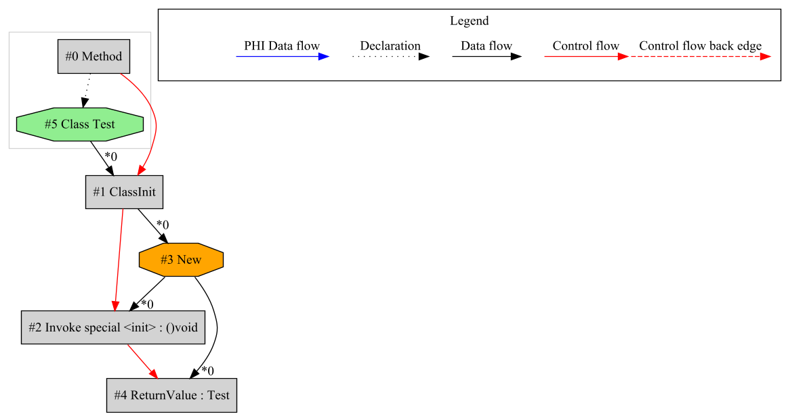

# MetaIR

MetaIR is a graph-based intermediate representation (IR) for JVM bytecode, built on Cliff Click's Sea-of-Nodes concept. 
The framework leverages the Java Class-File API introduced in Java 24 (JEP 484).

## Key Features

- **Analysis**: Transform and inspect existing JVM bytecode
- **Visualization**: Debug functionality for graph representation
- **Optimization**: Built-in peephole optimizations for graph reduction
- **Cross-Compilation**: Foundation framework for cross-compiler development

## Technical Details
- Built on [Java Class-File API (JEP 484)](https://openjdk.org/jeps/484)
- Implements Sea-of-Nodes IR design
- Further examples and documentation: [SeaOfNodes/Simple](https://github.com/SeaOfNodes/Simple)

> 🚧 Scheduling logic for machine code transformation is under development.

## Example new instance creation

A simple Java example with constructor invocation:
```
public class Test {

    public static Test newInstance() {
        return new Test();
    }
}
```

Class-File API Debug YAML:
```
  - method name: newInstance
    flags: [PUBLIC, STATIC]
    method type: ()Lde/mirkosertic/metair/Test;
    attributes: [Code]
    code: 
        max stack: 2
        max locals: 0
        attributes: [LineNumberTable]
        line numbers: 
          - {start: 0, line number: 32}
        //stack map frame @0: {locals: [], stack: []}
        0: {opcode: NEW, type: de/mirkosertic/metair/Test}
        3: {opcode: DUP}
        4: {opcode: INVOKESPECIAL, owner: de/mirkosertic/metair/Test, method name: <init>, method type: ()V}
        7: {opcode: ARETURN}
```

Generated IR (raw and unoptimized):



## Example constructor invocation

A simple Java example with constructor invocation:
```
public class Test {

    public Test() {
    }
}
```

Class-File API Debug YAML:
```
  - method name: <init>
    flags: [PUBLIC]
    method type: ()V
    attributes: [Code]
    code: 
        max stack: 1
        max locals: 1
        attributes: [LineNumberTable, LocalVariableTable]
        line numbers: 
          - {start: 0, line number: 5}
          - {start: 4, line number: 6}
        local variables: 
          - {start: 0, end: 5, slot: 0, name: this, type: Lde/mirkosertic/metair/Test;}
        //stack map frame @0: {locals: [THIS], stack: []}
        0: {opcode: ALOAD_0, slot: 0, type: Lde/mirkosertic/metair/Test;, variable name: this}
        1: {opcode: INVOKESPECIAL, owner: java/lang/Object, method name: <init>, method type: ()V}
        4: {opcode: RETURN}
```

Generated IR (raw and unoptimized):


## Example if / conditional logic

A simple Java example with an if-statement returning different values based on a condition:
```
public class Test {

    public static int simpleIf(int a, int b, int c, int d) {
        if (a > b) {
            return c;
        } else {
            return d;
        }
    }
}
```

Class-File API Debug YAML:
```
  - method name: simpleIf
    flags: [PUBLIC, STATIC]
    method type: (IIII)I
    attributes: [Code]
    code: 
        max stack: 2
        max locals: 4
        attributes: [LineNumberTable, LocalVariableTable, StackMapTable]
        line numbers: 
          - {start: 0, line number: 9}
          - {start: 5, line number: 10}
          - {start: 7, line number: 12}
        local variables: 
          - {start: 0, end: 9, slot: 0, name: a, type: I}
          - {start: 0, end: 9, slot: 1, name: b, type: I}
          - {start: 0, end: 9, slot: 2, name: c, type: I}
          - {start: 0, end: 9, slot: 3, name: d, type: I}
        stack map frames: 
            7: {locals: [int, int, int, int], stack: []}
        //stack map frame @0: {locals: [int, int, int, int], stack: []}
        0: {opcode: ILOAD_0, slot: 0, type: I, variable name: a}
        1: {opcode: ILOAD_1, slot: 1, type: I, variable name: b}
        2: {opcode: IF_ICMPLE, target: 7}
        5: {opcode: ILOAD_2, slot: 2, type: I, variable name: c}
        6: {opcode: IRETURN}
        //stack map frame @7: {locals: [int, int, int, int], stack: []}
        7: {opcode: ILOAD_3, slot: 3, type: I, variable name: d}
        8: {opcode: IRETURN}
```

Generated IR (raw and unoptimized):


## Example loop

A simple Java example with a loop:
```
public class Test {

    public static int forLoop(int a) {
        for (int i = 0; i < a; i++) {
            compute(i);
        }
        return a;
    }

    private static int compute(int a) {
        return a + 1;
    }
}
```

Class-File API Debug YAML:
```
  - method name: forLoop
    flags: [PUBLIC, STATIC]
    method type: (I)I
    attributes: [Code]
    code: 
        max stack: 2
        max locals: 2
        attributes: [LineNumberTable, LocalVariableTable, StackMapTable]
        line numbers: 
          - {start: 0, line number: 17}
          - {start: 7, line number: 18}
          - {start: 12, line number: 17}
          - {start: 18, line number: 20}
        local variables: 
          - {start: 2, end: 18, slot: 1, name: i, type: I}
          - {start: 0, end: 20, slot: 0, name: a, type: I}
        stack map frames: 
            2: {locals: [int, int], stack: []}
            18: {locals: [int], stack: []}
        //stack map frame @0: {locals: [int], stack: []}
        0: {opcode: ICONST_0, constant value: 0}
        1: {opcode: ISTORE_1, slot: 1}
        //stack map frame @2: {locals: [int, int], stack: []}
        2: {opcode: ILOAD_1, slot: 1, type: I, variable name: i}
        3: {opcode: ILOAD_0, slot: 0, type: I, variable name: a}
        4: {opcode: IF_ICMPGE, target: 18}
        7: {opcode: ILOAD_1, slot: 1, type: I, variable name: i}
        8: {opcode: INVOKESTATIC, owner: de/mirkosertic/metair/Test, method name: compute, method type: (I)I}
        11: {opcode: POP}
        12: {opcode: IINC, slot: 1, const: 1, type: I, variable name: i}
        15: {opcode: GOTO, target: 2}
        //stack map frame @18: {locals: [int], stack: []}
        18: {opcode: ILOAD_0, slot: 0, type: I, variable name: a}
        19: {opcode: IRETURN}
```

Generated IR (raw and unoptimized):


## Static method invocation

A simple static method invocation:
```
public class Test {

    private static int compute(int a) {
        return a + 1;
    }

    public int staticInvocationInMember() {
        return compute(10);
    }
}
```

Generated IR (raw and unoptimized):


## JVM instructions not yet implemented

> 🚧 Under development.

    /**
     * Push item from run-time constant pool (wide index).
     *
     * @jvms 6.5.ldc_w <em>ldc_w</em>
     * @see ConstantInstruction.LoadConstantInstruction
     * @see Kind#CONSTANT
     */
    LDC_W(RawBytecodeHelper.LDC_W, 3, Kind.CONSTANT),

    /**
     * Push {@link TypeKind#LONG long} or {@link TypeKind#DOUBLE double}
     * from run-time constant pool (wide index).
     *
     * @jvms 6.5.ldc2_w <em>ldc2_w</em>
     * @see ConstantInstruction.LoadConstantInstruction
     * @see Kind#CONSTANT
     */
    LDC2_W(RawBytecodeHelper.LDC2_W, 3, Kind.CONSTANT),

    /**
     * Pop the top one or two operand stack values.
     *
     * @jvms 6.5.pop2 <em>pop2</em>
     * @see Kind#STACK
     */
    POP2(RawBytecodeHelper.POP2, 1, Kind.STACK),

    /**
     * Duplicate the top operand stack value and insert two values down.
     *
     * @jvms 6.5.dup_x1 <em>dup_x1</em>
     * @see Kind#STACK
     */
    DUP_X1(RawBytecodeHelper.DUP_X1, 1, Kind.STACK),

    /**
     * Duplicate the top operand stack value and insert two or three values down.
     *
     * @jvms 6.5.dup_x2 <em>dup_x2</em>
     * @see Kind#STACK
     */
    DUP_X2(RawBytecodeHelper.DUP_X2, 1, Kind.STACK),

    /**
     * Duplicate the top one or two operand stack values.
     *
     * @jvms 6.5.dup2 <em>dup2</em>
     * @see Kind#STACK
     */
    DUP2(RawBytecodeHelper.DUP2, 1, Kind.STACK),

    /**
     * Duplicate the top one or two operand stack values and insert two or three
     * values down.
     *
     * @jvms 6.5.dup2_x1 <em>dup2_x1</em>
     * @see Kind#STACK
     */
    DUP2_X1(RawBytecodeHelper.DUP2_X1, 1, Kind.STACK),

    /**
     * Duplicate the top one or two operand stack values and insert two, three,
     * or four values down.
     *
     * @jvms 6.5.dup2_x2 <em>dup2_x2</em>
     * @see Kind#STACK
     */
    DUP2_X2(RawBytecodeHelper.DUP2_X2, 1, Kind.STACK),

    /**
     * Swap the top two operand stack values.
     *
     * @jvms 6.5.swap <em>swap</em>
     * @see Kind#STACK
     */
    SWAP(RawBytecodeHelper.SWAP, 1, Kind.STACK),

    /**
     * Divide {@link TypeKind#INT int}.
     *
     * @jvms 6.5.idiv <em>idiv</em>
     * @see Kind#OPERATOR
     */
    IDIV(RawBytecodeHelper.IDIV, 1, Kind.OPERATOR),

    /**
     * Divide {@link TypeKind#LONG long}.
     *
     * @jvms 6.5.ldiv <em>ldiv</em>
     * @see Kind#OPERATOR
     */
    LDIV(RawBytecodeHelper.LDIV, 1, Kind.OPERATOR),

    /**
     * Divide {@link TypeKind#FLOAT float}.
     *
     * @jvms 6.5.fdiv <em>fdiv</em>
     * @see Kind#OPERATOR
     */
    FDIV(RawBytecodeHelper.FDIV, 1, Kind.OPERATOR),

    /**
     * Divide {@link TypeKind#DOUBLE double}.
     *
     * @jvms 6.5.ddiv <em>ddiv</em>
     * @see Kind#OPERATOR
     */
    DDIV(RawBytecodeHelper.DDIV, 1, Kind.OPERATOR),

    /**
     * Remainder {@link TypeKind#INT int}.
     *
     * @jvms 6.5.irem <em>irem</em>
     * @see Kind#OPERATOR
     */
    IREM(RawBytecodeHelper.IREM, 1, Kind.OPERATOR),

    /**
     * Remainder {@link TypeKind#LONG long}.
     *
     * @jvms 6.5.lrem <em>lrem</em>
     * @see Kind#OPERATOR
     */
    LREM(RawBytecodeHelper.LREM, 1, Kind.OPERATOR),

    /**
     * Remainder {@link TypeKind#FLOAT float}.
     *
     * @jvms 6.5.frem <em>frem</em>
     * @see Kind#OPERATOR
     */
    FREM(RawBytecodeHelper.FREM, 1, Kind.OPERATOR),

    /**
     * Remainder {@link TypeKind#DOUBLE double}.
     *
     * @jvms 6.5.drem <em>drem</em>
     * @see Kind#OPERATOR
     */
    DREM(RawBytecodeHelper.DREM, 1, Kind.OPERATOR),

    /**
     * Negate {@link TypeKind#INT int}.
     *
     * @jvms 6.5.ineg <em>ineg</em>
     * @see Kind#OPERATOR
     */
    INEG(RawBytecodeHelper.INEG, 1, Kind.OPERATOR),

    /**
     * Negate {@link TypeKind#LONG long}.
     *
     * @jvms 6.5.lneg <em>lneg</em>
     * @see Kind#OPERATOR
     */
    LNEG(RawBytecodeHelper.LNEG, 1, Kind.OPERATOR),

    /**
     * Negate {@link TypeKind#FLOAT float}.
     *
     * @jvms 6.5.fneg <em>fneg</em>
     * @see Kind#OPERATOR
     */
    FNEG(RawBytecodeHelper.FNEG, 1, Kind.OPERATOR),

    /**
     * Negate {@link TypeKind#DOUBLE double}.
     *
     * @jvms 6.5.dneg <em>dneg</em>
     * @see Kind#OPERATOR
     */
    DNEG(RawBytecodeHelper.DNEG, 1, Kind.OPERATOR),

    /**
     * Shift left {@link TypeKind#INT int}.
     *
     * @jvms 6.5.ishl <em>ishl</em>
     * @see Kind#OPERATOR
     */
    ISHL(RawBytecodeHelper.ISHL, 1, Kind.OPERATOR),

    /**
     * Shift left {@link TypeKind#LONG long}.
     *
     * @jvms 6.5.lshl <em>lshl</em>
     * @see Kind#OPERATOR
     */
    LSHL(RawBytecodeHelper.LSHL, 1, Kind.OPERATOR),

    /**
     * Arithmetic shift right {@link TypeKind#INT int}.
     *
     * @jvms 6.5.ishr <em>ishr</em>
     * @see Kind#OPERATOR
     */
    ISHR(RawBytecodeHelper.ISHR, 1, Kind.OPERATOR),

    /**
     * Arithmetic shift right {@link TypeKind#LONG long}.
     *
     * @jvms 6.5.lshr <em>lshr</em>
     * @see Kind#OPERATOR
     */
    LSHR(RawBytecodeHelper.LSHR, 1, Kind.OPERATOR),

    /**
     * Logical shift right {@link TypeKind#INT int}.
     *
     * @jvms 6.5.iushr <em>iushr</em>
     * @see Kind#OPERATOR
     */
    IUSHR(RawBytecodeHelper.IUSHR, 1, Kind.OPERATOR),

    /**
     * Logical shift right {@link TypeKind#LONG long}.
     *
     * @jvms 6.5.lushr <em>lushr</em>
     * @see Kind#OPERATOR
     */
    LUSHR(RawBytecodeHelper.LUSHR, 1, Kind.OPERATOR),

    /**
     * Bitwise AND {@link TypeKind#INT int}.
     *
     * @apiNote
     * This may be used to implement {@link TypeKind#BOOLEAN boolean} AND.
     *
     * @jvms 6.5.iand <em>iand</em>
     * @see Kind#OPERATOR
     */
    IAND(RawBytecodeHelper.IAND, 1, Kind.OPERATOR),

    /**
     * Bitwise AND {@link TypeKind#LONG long}.
     *
     * @jvms 6.5.land <em>land</em>
     * @see Kind#OPERATOR
     */
    LAND(RawBytecodeHelper.LAND, 1, Kind.OPERATOR),

    /**
     * Bitwise OR {@link TypeKind#INT int}.
     *
     * @apiNote
     * This may be used to implement {@link TypeKind#BOOLEAN boolean} OR.
     *
     * @jvms 6.5.ior <em>ior</em>
     * @see Kind#OPERATOR
     */
    IOR(RawBytecodeHelper.IOR, 1, Kind.OPERATOR),

    /**
     * Bitwise OR {@link TypeKind#LONG long}.
     *
     * @jvms 6.5.lor <em>lor</em>
     * @see Kind#OPERATOR
     */
    LOR(RawBytecodeHelper.LOR, 1, Kind.OPERATOR),

    /**
     * Bitwise XOR {@link TypeKind#INT int}.
     *
     * @apiNote
     * This may be used to implement {@link TypeKind#BOOLEAN boolean} XOR.
     *
     * @jvms 6.5.ixor <em>ixor</em>
     * @see Kind#OPERATOR
     */
    IXOR(RawBytecodeHelper.IXOR, 1, Kind.OPERATOR),

    /**
     * Bitwise XOR {@link TypeKind#LONG long}.
     *
     * @jvms 6.5.lxor <em>lxor</em>
     * @see Kind#OPERATOR
     */
    LXOR(RawBytecodeHelper.LXOR, 1, Kind.OPERATOR),

    /**
     * Convert {@link TypeKind#INT int} to {@link TypeKind#LONG long}.
     *
     * @jls 5.1.2 Widening Primitive Conversion
     * @jvms 6.5.i2l <em>i2l</em>
     * @see Kind#CONVERT
     */
    I2L(RawBytecodeHelper.I2L, 1, Kind.CONVERT),

    /**
     * Convert {@link TypeKind#INT int} to {@link TypeKind#FLOAT float}.
     *
     * @jls 5.1.2 Widening Primitive Conversion
     * @jvms 6.5.i2f <em>i2f</em>
     * @see Kind#CONVERT
     */
    I2F(RawBytecodeHelper.I2F, 1, Kind.CONVERT),

    /**
     * Convert {@link TypeKind#INT int} to {@link TypeKind#DOUBLE double}.
     *
     * @jls 5.1.2 Widening Primitive Conversion
     * @jvms 6.5.i2d <em>i2d</em>
     * @see Kind#CONVERT
     */
    I2D(RawBytecodeHelper.I2D, 1, Kind.CONVERT),

    /**
     * Convert {@link TypeKind#LONG long} to {@link TypeKind#INT int}.
     *
     * @jls 5.1.3 Narrowing Primitive Conversion
     * @jvms 6.5.l2i <em>l2i</em>
     * @see Kind#CONVERT
     */
    L2I(RawBytecodeHelper.L2I, 1, Kind.CONVERT),

    /** Convert {@link TypeKind#LONG long} to {@link TypeKind#FLOAT float}.
     *
     * @jls 5.1.2 Widening Primitive Conversion
     * @jvms 6.5.l2f <em>l2f</em>
     * @see Kind#CONVERT
     */
    L2F(RawBytecodeHelper.L2F, 1, Kind.CONVERT),

    /** Convert {@link TypeKind#LONG long} to {@link TypeKind#DOUBLE double}.
     *
     * @jls 5.1.2 Widening Primitive Conversion
     * @jvms 6.5.l2d <em>l2d</em>
     * @see Kind#CONVERT
     */
    L2D(RawBytecodeHelper.L2D, 1, Kind.CONVERT),

    /**
     * Convert {@link TypeKind#FLOAT float} to {@link TypeKind#INT int}.
     *
     * @jls 5.1.3 Narrowing Primitive Conversion
     * @jvms 6.5.f2i <em>f2i</em>
     * @see Kind#CONVERT
     */
    F2I(RawBytecodeHelper.F2I, 1, Kind.CONVERT),

    /**
     * Convert {@link TypeKind#FLOAT float} to {@link TypeKind#LONG long}.
     *
     * @jls 5.1.3 Narrowing Primitive Conversion
     * @jvms 6.5.f2l <em>f2l</em>
     * @see Kind#CONVERT
     */
    F2L(RawBytecodeHelper.F2L, 1, Kind.CONVERT),

    /**
     * Convert {@link TypeKind#FLOAT float} to {@link TypeKind#DOUBLE double}.
     *
     * @jls 5.1.2 Widening Primitive Conversion
     * @jvms 6.5.f2d <em>f2d</em>
     * @see Kind#CONVERT
     */
    F2D(RawBytecodeHelper.F2D, 1, Kind.CONVERT),

    /**
     * Convert {@link TypeKind#DOUBLE double} to {@link TypeKind#INT int}.
     *
     * @jls 5.1.3 Narrowing Primitive Conversion
     * @jvms 6.5.d2i <em>d2i</em>
     * @see Kind#CONVERT
     */
    D2I(RawBytecodeHelper.D2I, 1, Kind.CONVERT),

    /**
     * Convert {@link TypeKind#DOUBLE double} to {@link TypeKind#LONG long}.
     *
     * @jvms 6.5.d2l <em>d2l</em>
     * @see Kind#CONVERT
     */
    D2L(RawBytecodeHelper.D2L, 1, Kind.CONVERT),

    /**
     * Convert {@link TypeKind#DOUBLE double} to {@link TypeKind#FLOAT float}.
     *
     * @jls 5.1.3 Narrowing Primitive Conversion
     * @jvms 6.5.d2f <em>d2f</em>
     * @see Kind#CONVERT
     */
    D2F(RawBytecodeHelper.D2F, 1, Kind.CONVERT),

    /**
     * Convert {@link TypeKind#INT int} to {@link TypeKind#BYTE byte}.
     * This is as if storing the {@linkplain TypeKind##computational-type
     * computational} {@code int} into a {@code byte} and loading it back.
     *
     * @jls 5.1.3 Narrowing Primitive Conversion
     * @jvms 6.5.i2b <em>i2b</em>
     * @see Kind#CONVERT
     */
    I2B(RawBytecodeHelper.I2B, 1, Kind.CONVERT),

    /**
     * Convert {@link TypeKind#INT int} to {@link TypeKind#CHAR char}.
     * This is as if storing the {@linkplain TypeKind##computational-type
     * computational} {@code int} into a {@code char} and loading it back.
     *
     * @jls 5.1.3 Narrowing Primitive Conversion
     * @jvms 6.5.i2c <em>i2c</em>
     * @see Kind#CONVERT
     */
    I2C(RawBytecodeHelper.I2C, 1, Kind.CONVERT),

    /**
     * Convert {@link TypeKind#INT int} to {@link TypeKind#SHORT short}.
     * This is as if storing the {@linkplain TypeKind##computational-type
     * computational} {@code int} into a {@code short} and loading it back.
     *
     * @jls 5.1.3 Narrowing Primitive Conversion
     * @jvms 6.5.i2s <em>i2s</em>
     * @see Kind#CONVERT
     */
    I2S(RawBytecodeHelper.I2S, 1, Kind.CONVERT),

    /**
     * Compare {@link TypeKind#LONG long}.
     *
     * @see Long#compare(long, long)
     * @jvms 6.5.lcmp <em>lcmp</em>
     * @see Kind#OPERATOR
     */
    LCMP(RawBytecodeHelper.LCMP, 1, Kind.OPERATOR),

    /**
     * Compare {@link TypeKind#FLOAT float}.
     * Produces {@code -1} if any operand is {@link Float#isNaN(float) NaN}.
     *
     * @see Double##equivalenceRelation Floating-point Equality, Equivalence, and Comparison
     * @jvms 6.5.fcmp_op <em>fcmp&lt;op&gt;</em>
     * @see Kind#OPERATOR
     */
    FCMPL(RawBytecodeHelper.FCMPL, 1, Kind.OPERATOR),

    /**
     * Compare {@link TypeKind#FLOAT float}.
     * Produces {@code 1} if any operand is {@link Float#isNaN(float) NaN}.
     *
     * @see Double##equivalenceRelation Floating-point Equality, Equivalence, and Comparison
     * @jvms 6.5.fcmp_op <em>fcmp&lt;op&gt;</em>
     * @see Kind#OPERATOR
     */
    FCMPG(RawBytecodeHelper.FCMPG, 1, Kind.OPERATOR),

    /**
     * Compare {@link TypeKind#DOUBLE double}.
     * Produces {@code -1} if any operand is {@link Double#isNaN(double) NaN}.
     *
     * @see Double##equivalenceRelation Floating-point Equality, Equivalence, and Comparison
     * @jvms 6.5.dcmp_op <em>dcmp&lt;op&gt;</em>
     * @see Kind#OPERATOR
     */
    DCMPL(RawBytecodeHelper.DCMPL, 1, Kind.OPERATOR),

    /**
     * Compare {@link TypeKind#DOUBLE double}.
     * Produces {@code 1} if any operand is {@link Double#isNaN(double) NaN}.
     *
     * @see Double##equivalenceRelation Floating-point Equality, Equivalence, and Comparison
     * @jvms 6.5.dcmp_op <em>dcmp&lt;op&gt;</em>
     * @see Kind#OPERATOR
     */
    DCMPG(RawBytecodeHelper.DCMPG, 1, Kind.OPERATOR),

    /**
     * Branch if {@link TypeKind#INT int} comparison {@code == 0} succeeds.
     *
     * @jvms 6.5.if_cond <em>if_&lt;cond&gt;</em>
     * @see Kind#BRANCH
     */
    IFEQ(RawBytecodeHelper.IFEQ, 3, Kind.BRANCH),

    /**
     * Branch if {@link TypeKind#INT int} comparison {@code != 0} succeeds.
     *
     * @jvms 6.5.if_cond <em>if_&lt;cond&gt;</em>
     * @see Kind#BRANCH
     */
    IFNE(RawBytecodeHelper.IFNE, 3, Kind.BRANCH),

    /**
     * Branch if {@link TypeKind#INT int} comparison {@code < 0} succeeds.
     *
     * @jvms 6.5.if_cond <em>if_&lt;cond&gt;</em>
     * @see Kind#BRANCH
     */
    IFLT(RawBytecodeHelper.IFLT, 3, Kind.BRANCH),

    /**
     * Branch if {@link TypeKind#INT int} comparison {@code >= 0} succeeds.
     *
     * @jvms 6.5.if_cond <em>if_&lt;cond&gt;</em>
     * @see Kind#BRANCH
     */
    IFGE(RawBytecodeHelper.IFGE, 3, Kind.BRANCH),

    /**
     * Branch if {@link TypeKind#INT int} comparison {@code > 0} succeeds.
     *
     * @jvms 6.5.if_cond <em>if_&lt;cond&gt;</em>
     * @see Kind#BRANCH
     */
    IFGT(RawBytecodeHelper.IFGT, 3, Kind.BRANCH),

    /**
     * Branch if {@link TypeKind#INT int} comparison {@code <= 0} succeeds.
     *
     * @jvms 6.5.if_cond <em>if_&lt;cond&gt;</em>
     * @see Kind#BRANCH
     */
    IFLE(RawBytecodeHelper.IFLE, 3, Kind.BRANCH),

    /**
     * Branch if {@link TypeKind#INT int} comparison {@code operand1 == operand2} succeeds.
     *
     * @jvms 6.5.if_icmp_cond <em>if_icmp&lt;cond&gt;</em>
     * @see Kind#BRANCH
     */
    IF_ICMPEQ(RawBytecodeHelper.IF_ICMPEQ, 3, Kind.BRANCH),

    /**
     * Branch if {@link TypeKind#INT int} comparison {@code operand1 != operand2} succeeds.
     *
     * @jvms 6.5.if_icmp_cond <em>if_icmp&lt;cond&gt;</em>
     * @see Kind#BRANCH
     */
    IF_ICMPNE(RawBytecodeHelper.IF_ICMPNE, 3, Kind.BRANCH),

    /**
     * Branch if {@link TypeKind#INT int} comparison {@code operand1 < operand2} succeeds.
     *
     * @jvms 6.5.if_icmp_cond <em>if_icmp&lt;cond&gt;</em>
     * @see Kind#BRANCH
     */
    IF_ICMPLT(RawBytecodeHelper.IF_ICMPLT, 3, Kind.BRANCH),

    /**
     * Branch if {@link TypeKind#INT int} comparison {@code operand1 > operand2} succeeds.
     *
     * @jvms 6.5.if_icmp_cond <em>if_icmp&lt;cond&gt;</em>
     * @see Kind#BRANCH
     */
    IF_ICMPGT(RawBytecodeHelper.IF_ICMPGT, 3, Kind.BRANCH),

    /**
     * Branch if {@link TypeKind#REFERENCE reference} comparison
     * {@code operand1 == operand2} succeeds.
     *
     * @jvms 6.5.if_acmp_cond <em>if_acmp&lt;cond&gt;</em>
     * @see Kind#BRANCH
     */
    IF_ACMPEQ(RawBytecodeHelper.IF_ACMPEQ, 3, Kind.BRANCH),

    /**
     * Branch if {@link TypeKind#REFERENCE reference} comparison
     * {@code operand1 != operand2} succeeds.
     *
     * @jvms 6.5.if_acmp_cond <em>if_acmp&lt;cond&gt;</em>
     * @see Kind#BRANCH
     */
    IF_ACMPNE(RawBytecodeHelper.IF_ACMPNE, 3, Kind.BRANCH),

    /**
     * (Discontinued) Jump subroutine; last used in major version {@value
     * ClassFile#JAVA_6_VERSION}.
     *
     * @jvms 4.9.1 Static Constraints
     * @jvms 6.5.jsr <em>jsr</em>
     * @see Kind#DISCONTINUED_JSR
     */
    JSR(RawBytecodeHelper.JSR, 3, Kind.DISCONTINUED_JSR),

    /**
     * (Discontinued) Return from subroutine; last used in major version
     * {@value ClassFile#JAVA_6_VERSION}.
     *
     * @jvms 4.9.1 Static Constraints
     * @jvms 6.5.ret <em>ret</em>
     * @see Kind#DISCONTINUED_RET
     */
    RET(RawBytecodeHelper.RET, 2, Kind.DISCONTINUED_RET),

    /**
     * Access jump table by index and jump.
     *
     * @jvms 6.5.tableswitch <em>tableswitch</em>
     * @see Kind#TABLE_SWITCH
     */
    TABLESWITCH(RawBytecodeHelper.TABLESWITCH, -1, Kind.TABLE_SWITCH),

    /**
     * Access jump table by key match and jump.
     *
     * @jvms 6.5.lookupswitch <em>lookupswitch</em>
     * @see Kind#LOOKUP_SWITCH
     */
    LOOKUPSWITCH(RawBytecodeHelper.LOOKUPSWITCH, -1, Kind.LOOKUP_SWITCH),

    /**
     * Set {@code static} field in class.
     *
     * @jvms 6.5.putstatic <em>putstatic</em>
     * @see Kind#FIELD_ACCESS
     */
    PUTSTATIC(RawBytecodeHelper.PUTSTATIC, 3, Kind.FIELD_ACCESS),

    /**
     * Set field in object.
     *
     * @jvms 6.5.putfield <em>putfield</em>
     * @see Kind#FIELD_ACCESS
     */
    PUTFIELD(RawBytecodeHelper.PUTFIELD, 3, Kind.FIELD_ACCESS),

    /**
     * Invoke a dynamically-computed call site.
     *
     * @jvms 6.5.invokedynamic <em>invokedynamic</em>
     * @see Kind#INVOKE_DYNAMIC
     */
    INVOKEDYNAMIC(RawBytecodeHelper.INVOKEDYNAMIC, 5, Kind.INVOKE_DYNAMIC),

    /**
     * Determine if object is of given type.
     *
     * @see Class#isInstance(Object)
     * @jvms 6.5.instanceof <em>instanceof</em>
     * @see Kind#TYPE_CHECK
     */
    INSTANCEOF(RawBytecodeHelper.INSTANCEOF, 3, Kind.TYPE_CHECK),

    /**
     * Create new multidimensional array.
     *
     * @jvms 6.5.multianewarray <em>multianewarray</em>
     * @see Kind#NEW_MULTI_ARRAY
     */
    MULTIANEWARRAY(RawBytecodeHelper.MULTIANEWARRAY, 4, Kind.NEW_MULTI_ARRAY),

    /**
     * Branch if {@link TypeKind#REFERENCE reference} is {@code null}.
     *
     * @jvms 6.5.ifnull <em>ifnull</em>
     * @see Kind#BRANCH
     */
    IFNULL(RawBytecodeHelper.IFNULL, 3, Kind.BRANCH),

    /**
     * Branch if {@link TypeKind#REFERENCE reference} is not {@code null}.
     *
     * @jvms 6.5.ifnonnull <em>ifnonnull</em>
     * @see Kind#BRANCH
     */
    IFNONNULL(RawBytecodeHelper.IFNONNULL, 3, Kind.BRANCH),

    /**
     * Branch always (wide index).
     *
     * @jvms 6.5.goto_w <em>goto_w</em>
     * @see Kind#BRANCH
     */
    GOTO_W(RawBytecodeHelper.GOTO_W, 5, Kind.BRANCH),

    /**
     * (Discontinued) Jump subroutine (wide index); last used in major
     * version {@value ClassFile#JAVA_6_VERSION}.
     *
     * @jvms 4.9.1 Static Constraints
     * @jvms 6.5.jsr_w <em>jsr_w</em>
     * @see Kind#DISCONTINUED_JSR
     */
    JSR_W(RawBytecodeHelper.JSR_W, 5, Kind.DISCONTINUED_JSR),

    /**
     * Load {@link TypeKind#INT int} from local variable (wide index).
     * This is a {@linkplain #isWide() wide}-modified pseudo-opcode.
     *
     * @jvms 6.5.wide <em>wide</em>
     * @jvms 6.5.iload <em>iload</em>
     * @see Kind#LOAD
     */
    ILOAD_W((RawBytecodeHelper.WIDE << 8) | RawBytecodeHelper.ILOAD, 4, Kind.LOAD),

    /**
     * Load {@link TypeKind#LONG long} from local variable (wide index).
     * This is a {@linkplain #isWide() wide}-modified pseudo-opcode.
     *
     * @jvms 6.5.wide <em>wide</em>
     * @jvms 6.5.lload <em>lload</em>
     * @see Kind#LOAD
     */
    LLOAD_W((RawBytecodeHelper.WIDE << 8) | RawBytecodeHelper.LLOAD, 4, Kind.LOAD),

    /**
     * Load {@link TypeKind#FLOAT float} from local variable (wide index).
     * This is a {@linkplain #isWide() wide}-modified pseudo-opcode.
     *
     * @jvms 6.5.wide <em>wide</em>
     * @jvms 6.5.fload <em>fload</em>
     * @see Kind#LOAD
     */
    FLOAD_W((RawBytecodeHelper.WIDE << 8) | RawBytecodeHelper.FLOAD, 4, Kind.LOAD),

    /**
     * Load {@link TypeKind#DOUBLE double} from local variable (wide index).
     * This is a {@linkplain #isWide() wide}-modified pseudo-opcode.
     *
     * @jvms 6.5.wide <em>wide</em>
     * @jvms 6.5.dload <em>dload</em>
     * @see Kind#LOAD
     */
    DLOAD_W((RawBytecodeHelper.WIDE << 8) | RawBytecodeHelper.DLOAD, 4, Kind.LOAD),

    /**
     * Load {@link TypeKind#REFERENCE reference} from local variable (wide index).
     * This is a {@linkplain #isWide() wide}-modified pseudo-opcode.
     *
     * @jvms 6.5.wide <em>wide</em>
     * @jvms 6.5.aload <em>aload</em>
     * @see Kind#LOAD
     */
    ALOAD_W((RawBytecodeHelper.WIDE << 8) | RawBytecodeHelper.ALOAD, 4, Kind.LOAD),

    /**
     * Store {@link TypeKind#INT int} into local variable (wide index).
     * This is a {@linkplain #isWide() wide}-modified pseudo-opcode.
     *
     * @jvms 6.5.wide <em>wide</em>
     * @jvms 6.5.istore <em>istore</em>
     * @see Kind#STORE
     */
    ISTORE_W((RawBytecodeHelper.WIDE << 8) | RawBytecodeHelper.ISTORE, 4, Kind.STORE),

    /**
     * Store {@link TypeKind#LONG long} into local variable (wide index).
     * This is a {@linkplain #isWide() wide}-modified pseudo-opcode.
     *
     * @jvms 6.5.wide <em>wide</em>
     * @jvms 6.5.lstore <em>lstore</em>
     * @see Kind#STORE
     */
    LSTORE_W((RawBytecodeHelper.WIDE << 8) | RawBytecodeHelper.LSTORE, 4, Kind.STORE),

    /**
     * Store {@link TypeKind#FLOAT float} into local variable (wide index).
     * This is a {@linkplain #isWide() wide}-modified pseudo-opcode.
     *
     * @jvms 6.5.wide <em>wide</em>
     * @jvms 6.5.fstore <em>fstore</em>
     * @see Kind#STORE
     */
    FSTORE_W((RawBytecodeHelper.WIDE << 8) | RawBytecodeHelper.FSTORE, 4, Kind.STORE),

    /**
     * Store {@link TypeKind#DOUBLE double} into local variable (wide index).
     * This is a {@linkplain #isWide() wide}-modified pseudo-opcode.
     *
     * @jvms 6.5.wide <em>wide</em>
     * @jvms 6.5.dstore <em>dstore</em>
     * @see Kind#STORE
     */
    DSTORE_W((RawBytecodeHelper.WIDE << 8) | RawBytecodeHelper.DSTORE, 4, Kind.STORE),

    /**
     * Store {@link TypeKind#REFERENCE reference} into local variable (wide index).
     * This is a {@linkplain #isWide() wide}-modified pseudo-opcode.
     * Can also store the {@link TypeKind##returnAddress returnAddress} type.
     *
     * @jvms 6.5.wide <em>wide</em>
     * @jvms 6.5.astore <em>astore</em>
     * @see Kind#STORE
     */
    ASTORE_W((RawBytecodeHelper.WIDE << 8) | RawBytecodeHelper.ASTORE, 4, Kind.STORE),

    /**
     * (Discontinued) Return from subroutine (wide index); last used in major
     * version {@value ClassFile#JAVA_6_VERSION}.
     * This is a {@linkplain #isWide() wide}-modified pseudo-opcode.
     *
     * @jvms 4.9.1 Static Constraints
     * @jvms 6.5.wide <em>wide</em>
     * @jvms 6.5.ret <em>ret</em>
     * @see Kind#DISCONTINUED_RET
     */
    RET_W((RawBytecodeHelper.WIDE << 8) | RawBytecodeHelper.RET, 4, Kind.DISCONTINUED_RET),

    /**
     * Increment local variable by constant (wide index).
     * This is a {@linkplain #isWide() wide}-modified pseudo-opcode.
     *
     * @jvms 6.5.wide <em>wide</em>
     * @jvms 6.5.iinc <em>iinc</em>
     * @see Kind#INCREMENT
     */
    IINC_W((RawBytecodeHelper.WIDE << 8) | RawBytecodeHelper.IINC, 6, Kind.INCREMENT);
