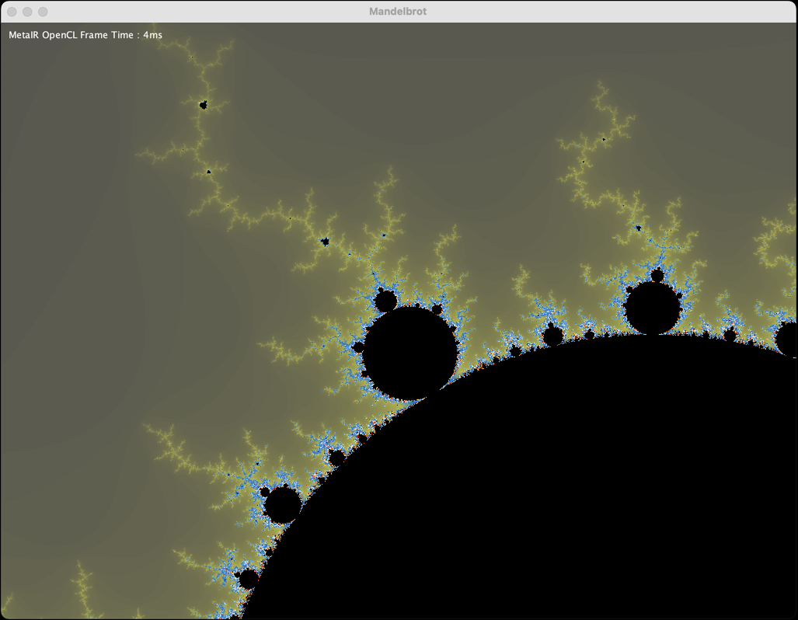

# MataIR OpenCL Example

MetaIR is a powerful tool that enables seamless hardware acceleration by transforming pure Java code into OpenCL. This
approach offers several key advantages:

## Key Benefits

1. **Pure Java Development**
    - Write code in familiar Java syntax without learning OpenCL
    - Leverage existing Java tools, IDEs and debugging capabilities
    - Maintain single codebase without parallel OpenCL implementation
    - Full type safety and compile-time checks

2. **Automatic Optimization**
    - MetaIR analyzes bytecode and performs optimizations
    - Generates efficient OpenCL code targeting GPU architecture
    - Handles memory management and data transfers
    - Optimal work distribution across compute units

3. **Platform Independence**
    - Code runs on any OpenCL-capable device (GPU, CPU, FPGA)
    - Automatic platform detection and initialization
    - Transparent fallback to CPU if no OpenCL device available
    - Future-proof for new hardware acceleration technologies

4. **Performance Benefits**
    - Massive parallel execution on GPU cores
    - Hardware-optimized floating point calculations
    - Reduced data transfer overhead
    - Orders of magnitude faster than CPU for suitable workloads

## How it Works

At runtime, MetaIR performs the following steps:

* Analyzes the JVM bytecode from the class file
* Transforms the bytecode into a MetaIR IR (Intermediate Representation)
* Generates optimized OpenCL code from the IR
* Loads the OpenCL library for your platform using the [Java Foreign Function & Memory API (JEP 454)](https://openjdk.org/jeps/454)
* Handles data transfer and kernel execution
* Returns results back to the JVM

This enables transparent hardware acceleration while maintaining pure Java development. The following Mandelbrot fractal
example demonstrates the approach:

*Computed Mandelbrot*:



Some performance numbers:

* OpenCL with Hardware Acceleration takes ~3ms per Frame on a Mac Pro M4.
* Without OpenCL, the same computation takes ~35ms per Frame on a Mac Pro M4.

MetaIR will use regular JVM execution if no OpenCL device is available or the OpenCL library cannot be loaded.

*Embedding*:

```java
import de.mirkosertic.metair.opencl.api.Context;
import de.mirkosertic.metair.opencl.api.OpenCLOptions;
import de.mirkosertic.metair.opencl.api.Platform;
import de.mirkosertic.metair.opencl.api.PlatformFactory;

import java.io.IOException;

public class MandelbrotOpenCL {

    private final Platform platform;
    private final Context context;
    private final MandelbrotKernel kernel;
    private long computingTime;

    public MandelbrotOpenCL() {
        // Initialize the MetaIUR OpenCL platform and context
        platform = PlatformFactory.resolve().createPlatform(new OpenCLOptions.Builder().build());
        // A Context is a container for a set of kernels and their associated data
        // It is used to execute the kernels on the OpenCL device
        context = platform.createContext();
        // The kernel is the workhorse. Its bytecode is later compiled to OpenCL code
        kernel = new MandelbrotKernel(1024, 768, 512);
    }

    public MandelbrotKernel compute() throws IOException {
        // Here we do the actual computation. The kernel is executed on the OpenCL device
        // and the results are returned to the JVM. On its first execution, the kernel
        // is compiled from the JVM bytecode and optimized for the OpenCL device.
        // The kernel is then cached and reused for subsequent executions in the same context.
        final long start = System.currentTimeMillis();
        context.compute(kernel.getWidth() * kernel.getHeight(), kernel);
        computingTime = System.currentTimeMillis() - start;
        return kernel;
    }

    public long getComputingTime() {
        return computingTime;
    }
}
```

*The OpenCL Kernel*:

```java
import de.mirkosertic.metair.opencl.api.Kernel;

import static de.mirkosertic.metair.opencl.api.GlobalFunctions.get_global_id;

public class MandelbrotKernel extends Kernel {

    private final int maxIterations;
    private final int width;
    private final int height;
    private float x_min;
    private float y_min;
    private float x_max;
    private float y_max;
    private final int[] imageData;
    private float cellSize_width;
    private float cellSize_height;

    public MandelbrotKernel(final int aWidth, final int aHeight, final int aMaxIterations) {
        width = aWidth;
        height = aHeight;
        imageData = new int[width * height];
        maxIterations = aMaxIterations;
        x_min = -2f;
        x_max = 2f;
        y_min = -1.5f;
        y_max = 1.5f;
        fitCellSize();
    }

    public void fitCellSize() {
        cellSize_width = (x_max - x_min) / width;
        cellSize_height = (y_max - y_min) / height;
    }

    private int checkC(final float reC, final float imC) {
        float reZ=0,imZ=0,reZ_minus1=0,imZ_minus1=0;
        int i;
        for (i=0;i<maxIterations;i++) {
            imZ=2*reZ_minus1*imZ_minus1+imC;
            reZ=reZ_minus1*reZ_minus1-imZ_minus1*imZ_minus1+reC;
            if (reZ*reZ+imZ*imZ>4) return i;
            reZ_minus1=reZ;
            imZ_minus1=imZ;
        }
        return i;
    }

    @Override
    public void processWorkItem() {
        final int pixelIndex = get_global_id(0);
        final int x = pixelIndex % width;
        final int y = pixelIndex / width;

        final float reC = x_min + (x * cellSize_width);
        final float imC = y_min + (y * cellSize_height);

        imageData[pixelIndex] = checkC(reC, imC);
    }

    public int getMaxIterations() {
        return maxIterations;
    }

    public int getWidth() {
        return width;
    }

    public int getHeight() {
        return height;
    }

    public int[] getImageData() {
        return imageData;
    }

    public void zoomInOut(final float amount) {
        final float width = x_max - x_min;
        final float height = y_max - y_min;

        final float centerX = x_min + width / 2;
        final float centerY = y_min + height / 2;

        final float newHalfWidth = width * (1 + 0.05f * amount) / 2;
        final float newHalfHeight = height * (1 + 0.05f * amount) / 2;

        x_min = centerX - newHalfWidth;
        x_max = centerX + newHalfWidth;
        y_min = centerY - newHalfHeight;
        y_max = centerY + newHalfHeight;

        fitCellSize();
    }

    public void focusOn(final int x, final int y) {

        final float halfWidth = (x_max - x_min) / 2;
        final float halfHeight = (y_max - y_min) / 2;

        final float newCenterX = x_min + x * cellSize_width;
        final float newCenterY = y_min + y * cellSize_height;

        x_min = newCenterX - halfWidth;
        x_max = newCenterX + halfWidth;
        y_min = newCenterY - halfHeight;
        y_max = newCenterY + halfHeight;
    }
}
```

*OpenCL Kernel Code*:

```
// Utility functions for the OpenCL code generation
__inline int numcomp_int(int a, int b) {
    return (a < b) ? -1 : (a == b) ? 0 : 1;
}

__inline int numcomp_long(long a, long b) {
    return (a < b) ? -1 : (a == b) ? 0 : 1;
}

__inline int numcomp_float(float a, float b) {
    return (a < b) ? -1 : (a == b) ? 0 : 1;
}

__inline int numcomp_double(double a, double b) {
    return (a < b) ? -1 : (a == b) ? 0 : 1;
}

int checkC(int maxIterations, __global int* imageData, float cellSize_height, int width, float y_min, float x_min, float cellSize_width, float arg0, float arg1) {
  int phi0;
  float phi1;
  float phi2;
  float phi3;
  float phi4;
  // Label Frame8
  // Label Frame12
  // Label Frame15
  // Label Frame18
  phi0 = 0;
  phi1 = 0.0;
  phi2 = 0.0;
  phi3 = 0.0;
  phi4 = 0.0;
  // Label Frame21
  $LoopHeaderNode_6: while (true) {
    if ((phi0 >= maxIterations)) {
      // Label Frame73
      return phi0;
    } else {
      float var5 = (((phi4 * phi4) - (phi3 * phi3)) + arg0);
      float var6 = (((2.0 * phi4) * phi3) + arg1);
      if ((numcomp_float(((var5 * var5) + (var6 * var6)), 4.0) <= 0)) {
        // Label Frame63
        phi0 = (phi0 + 1);
        phi1 = var5;
        phi2 = var6;
        phi3 = var6;
        phi4 = var5;
        goto $LoopHeaderNode_6;
      } else {
        return phi0;
      }
    }
  }
}

__kernel void processWorkItem(int maxIterations, __global int* imageData, float cellSize_height, int width, float y_min, float x_min, float cellSize_width) {
  // Label Frame6
  int var7 = get_global_id(0);
  // Label Frame11
  int var8 = (var7 % width);
  // Label Frame18
  int var9 = (var7 / width);
  // Label Frame25
  // Label Frame36
  // Label Frame47
  int var10 = checkC(maxIterations,imageData,cellSize_height,width,y_min,x_min,cellSize_width,(x_min + (((float)var8) * cellSize_width)),(y_min + (((float)var9) * cellSize_height)));
  imageData[var7] = var10;
  return;
}
```